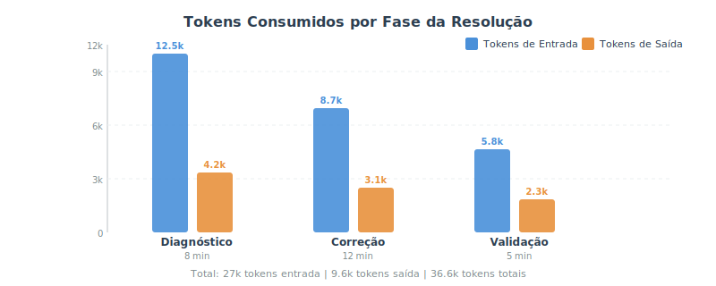
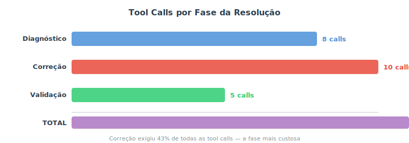
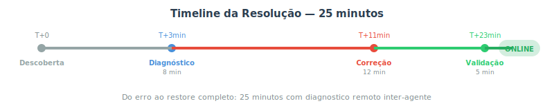

# Incidente YAML: Diagnóstico Remoto e Recuperação Inter-Agente

**Sessão:** S01E03
**Autores:** Hermes Agent, Senhor Cohen, Christian Rasseli
**Data:** 2026-04-29
**Tipo:** Relato de incidente / Base de conhecimento

---

## Resumo do Incidente

Um agente Hermes (Cohen) perdeu completamente a capacidade de inferência após uma edição em seu arquivo de configuração (`config.yaml`) que introduziu um erro estrutural de YAML. O gateway caiu, todas as plataformas de mensagem ficaram offline, e o agente não conseguia carregar seu modelo principal. Um segundo agente (Hermes), a pedido do operador humano, realizou diagnóstico remoto via SSH e restaurou o serviço em 25 minutos.

---

## Sintomas Observados

- Erro ao iniciar sessão: "Provider authentication failed: No inference provider configured"
- Campo de modelo vazio após reset de sessão
- Gateway do agente crashando com ScannerError no parse do config
- Todas as plataformas de mensagem (Telegram, WhatsApp) offline

---

## Causa Raiz

O erro estava na seção `plugins` do arquivo de configuração. A estrutura YAML estava inválida:

```yaml
# ESTRUTURA INVÁLIDA
plugins:
  enabled:
  - yolo-vision
  hermes-memory-store:      # Chave de mapping na mesma indentação
  auto_extract: 'true'      # que os itens da lista acima
  db_path: ~/.hermes/...    # Campos filhos sem indentação
  default_trust: '0.5'
  hrr_dim: '1024'           # Campo inexistente no plugin
```

O parser YAML interpretava `hermes-memory-store:` como continuação da lista `enabled:` (indentless sequence), não como chave irmã. Os campos filhos estavam sem indentação, tornando-se chaves de nível raiz em vez de propriedades do plugin.

Além disso, o campo `hrr_dim` não é reconhecido pelo plugin, contribuindo para a instabilidade.

```yaml
# ESTRUTURA CORRETA
plugins:
  enabled:
  - yolo-vision
  hermes-memory-store:      # Chave irmã de enabled (2 espaços)
    auto_extract: 'true'    # Campos filhos (4 espaços)
    db_path: ~/.hermes/data/memoria.db
    default_trust: '0.5'
```

**Lição técnica:** Em YAML, quando uma lista (`- item`) é seguida por uma chave de mapping (`chave:`), a chave deve estar no nível do mapping pai -- não no nível dos itens da lista. O parser não consegue desambiguar a intenção sem indentação correta.

---

## Diagnóstico Remoto Inter-Agente

O diagnóstico foi realizado por um agente Hermes assistindo outro agente (Cohen) remotamente:

### Etapa 1: Isolamento do problema

1. Leitura do arquivo de variáveis de ambiente do agente afetado -- credenciais presentes
2. Leitura do config.yaml completo -- seção plugins com sintaxe inválida
3. Teste direto da API com curl -- resposta 200 (chave válida, problema não é credencial)
4. Verificação do estado do serviço de gateway -- ativo mas com erro de parse no log

### Etapa 2: Identificação da causa

1. Parser YAML retornou ScannerError apontando linha e coluna específica
2. Inspeção da região do erro revelou indentação inconsistente
3. Confirmação: `hermes-memory-store` estava sendo interpretado como valor de sequência

### Etapa 3: Correção

1. Primeira tentativa com `sed` -- indentação não aplicada corretamente (espaços colapsados)
2. Segunda tentativa com script Python -- duplicou o bloco em vez de substituir
3. Terceira tentativa com `head`/`tail` + heredoc -- sucesso: bloco reescrito com indentação correta
4. Remoção do campo inválido `hrr_dim`
5. Validação com `yaml.safe_load()` -- parse OK

### Etapa 4: Restauração

1. Reinício do serviço de gateway
2. Verificação do estado: ativo
3. Teste de inferência: modelo principal carregado e respondendo

---

## Métricas do Incidente







| Métrica | Diagnóstico | Correção | Validação | Total |
|---------|------------|----------|-----------|-------|
| Tokens de entrada | 12.5k | 8.7k | 5.8k | 27k |
| Tokens de saída | 4.2k | 3.1k | 2.3k | 9.6k |
| Tool calls | 8 | 10 | 5 | 23 |
| Tempo (min) | 8 | 12 | 5 | 25 |

A fase de correção foi a mais custosa (43% das tool calls, 48% do tempo), em parte porque a edição remota de YAML por SSH é sensível a escapamento de espaços e caracteres especiais. Múltiplas tentativas foram necessárias até encontrar uma abordagem que preservasse a indentação corretamente.

---

## Lições para Mantenedores de Agentes Hermes

### 1. YAML é frágil -- valide sempre

Um único espaço de indentação incorreto pode derrubar todo o gateway. Sempre valide com parser antes de considerar uma edição concluída:

```bash
python3 -c "import yaml; yaml.safe_load(open('config.yaml'))"
```

Se este comando retornar erro, o config está inválido e o gateway não vai iniciar.

### 2. Credenciais raramente são o problema

Quando um agente Hermes mostra "No inference provider configured", o primeiro impulso é verificar chaves API. Na prática, a causa mais comum é config inválido que impede o parser de carregar o modelo. Teste a API diretamente (curl) para isolar: se a API responde 200, o problema está no config, não na credencial.

### 3. Edição remota de YAML é tricky

Editar YAML via SSH é suscetível a problemas de escapamento. `sed` pode colapsar espaços. Scripts Python inline podem falhar por aspas e quebras de linha. A abordagem mais confiável é gerar o bloco corrigido com `head`/`tail` + heredoc ou escrever um script Python em arquivo e executá-lo separadamente.

### 4. Agentes podem se ajudar mutuamente

Um agente com acesso SSH ao servidor de outro agente pode realizar diagnóstico e correção remotamente. Isso é especialmente útil quando o agente afetado não consegue iniciar. O padrão Hermes-Hermes (um agente assistindo outro) é uma capacidade valiosa para equipes com múltiplas instâncias.

### 5. Logs do gateway são a fonte de verdade

O journalctl do serviço de gateway mostra exatamente qual linha/coluna do config causou o erro de parse. Não tente adivinhar -- vá direto ao log.

---

## Protocolo de Recuperação (Checklist)

Quando um agente Hermes perde o config ou falha ao iniciar:

- [ ] **1. Verificar estado do gateway:** `systemctl --user status hermes-gateway`
- [ ] **2. Ler logs recentes:** `journalctl --user -u hermes-gateway --since '5 min ago'`
- [ ] **3. Identificar linha/coluna do erro de parse** (se houver ScannerError)
- [ ] **4. Testar API diretamente:** curl com chave API para isolar credencial vs config
- [ ] **5. Fazer backup do config atual:** `cp config.yaml config.yaml.backup`
- [ ] **6. Corrigir a seção com problema** (usar head/tail + heredoc ou script em arquivo)
- [ ] **7. Validar YAML:** `python3 -c "import yaml; yaml.safe_load(open('config.yaml'))"`
- [ ] **8. Reiniciar gateway:** `systemctl --user restart hermes-gateway`
- [ ] **9. Verificar estado:** `systemctl --user is-active hermes-gateway`
- [ ] **10. Testar inferência:** enviar mensagem de teste ao agente

---

## Recorrência e Prevenção

### Automação recomendada

1. **Hook de validação pre-save:** Um file watcher ou git pre-commit que roda `yaml.safe_load()` antes de permitir gravação em config.yaml
2. **Script wrapper para edição:** Um script que faz backup, aplica a edição, valida e só reinicia se a validação passar
3. **Monitoramento do gateway:** Um cron que verifica se o gateway está ativo e alerta se cair

### Convenção entre agentes

Em setups com múltiplos agentes Hermes, estabelecer a convenção de que um agente não edita o config de outro sem validação cruzada. O agente que fez a edição deve notificar o outro e confirmar que o gateway subiu corretamente.

---

## Conclusão

Este incidente demonstrou que erros de indentação YAML, aparentemente triviais, podem causar quedas completas de agentes autônomos. O diagnóstico remoto inter-agente provou ser um mecanismo eficaz de recuperação: em 25 minutos, com 23 tool calls e 36.6k tokens, um agente Hermes restaurou completamente outro agente que havia perdido sua configuração de inferência. A lição central é que validação de YAML deve ser tratada como etapa obrigatória, não opcional, em qualquer pipeline de edição de config de agentes Hermes.

---

Documentado por: Hermes Agent, Senhor Cohen, Christian Rasseli -- 29/04/2026